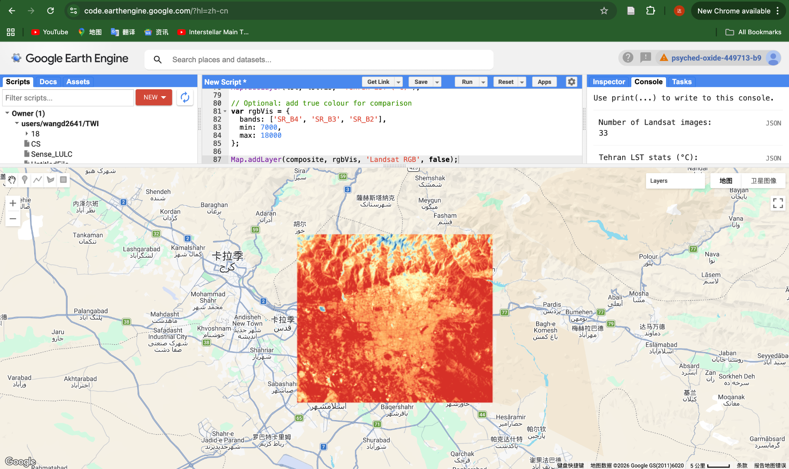

## Overview

This week focused on thermal remote sensing and the measurement of land surface temperature (LST). The lecture introduced how satellite data can be used to analyse temperature patterns in urban environments, particularly in relation to the urban heat island effect.

## Key Concepts

A key distinction introduced this week is between land surface temperature (LST) and air temperature.

-   LST measures the temperature of the Earth's surface as observed by a satellite sensor\
-   Air temperature is measured near the ground and influenced by atmospheric conditions

Thermal remote sensing allows us to estimate LST using thermal infrared bands, such as those available in Landsat data.

## Method

In this practical, Landsat 8/9 Collection 2 Level 2 data was used to derive land surface temperature for Tehran during the summer period.

A cloud mask was applied to remove low-quality pixels, and a median composite was generated. The thermal band (ST_B10) was then converted to degrees Celsius using the official scaling factors provided by USGS.

## Results

**Figure 1.** Summer land surface temperature (LST) in Tehran derived from Landsat 8/9 data.

The map shows clear spatial variation in temperature across the city. Urban areas appear significantly warmer than surrounding mountainous regions, indicating a strong urban heat island effect.

## Application

Thermal remote sensing can support urban policy and planning in several ways:

-   identifying urban heat hotspots\
-   informing green infrastructure planning\
-   supporting climate adaptation strategies

By providing spatially continuous temperature data, remote sensing enables cities to better understand and respond to heat-related risks.

## Reflection

This week expanded my understanding of remote sensing beyond visible imagery to include thermal processes.

I found it particularly interesting that satellite data can be used to estimate surface temperature at a city-wide scale. The distinction between LST and air temperature is also important, as they represent different environmental processes.

## Practical Reflection

The practical demonstrated how relatively simple workflows can produce meaningful environmental insights.

Compared to previous weeks, the focus was less on complex processing and more on interpreting results in an urban context.

## Limitations

One limitation is that land surface temperature does not directly represent human thermal comfort, which depends on additional factors such as humidity and wind.

In addition, the spatial resolution of Landsat (30 m) may not capture fine-scale urban variations.

## Future Application

This approach could be extended by combining LST with vegetation indices (e.g. NDVI) to better understand the relationship between green space and urban temperature.

It also has strong potential for applications in climate adaptation and urban sustainability planning.
