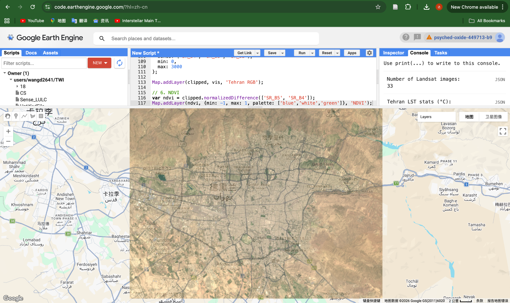
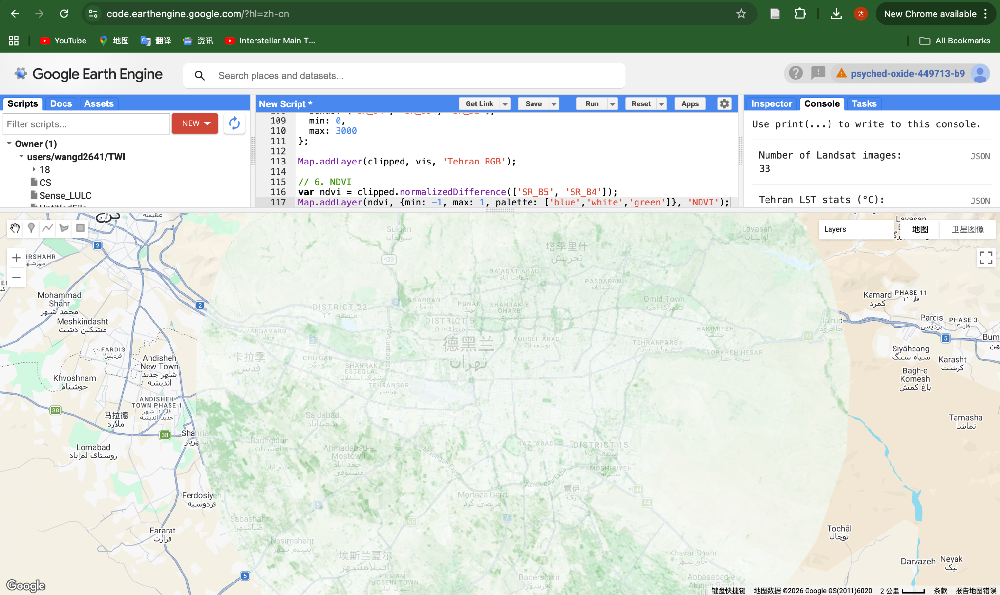

## Overview

This week introduced Google Earth Engine (GEE) as a cloud-based platform for remote sensing analysis. The focus was on learning the basic workflow of loading, filtering, compositing, clipping, and visualising satellite imagery.

## Key Concepts

Unlike previous practicals that relied on local processing, GEE allows satellite data to be processed remotely on Google’s servers. This makes it easier to work with large Earth observation datasets efficiently.

The main concepts covered this week included:

-   loading image collections
-   filtering by date, cloud cover, and location
-   creating composite images
-   clipping data to a study area
-   applying simple band math such as NDVI

## Method

In this practical, Landsat 8 surface reflectance data was used to analyse Tehran.

The workflow involved:

-   filtering imagery by date and cloud cover
-   generating a median composite
-   clipping the imagery to the study area
-   visualising the RGB composite
-   calculating NDVI using the near-infrared and red bands

## Results

**Figure 1.** Median Landsat RGB composite of Tehran clipped to the study area.

The RGB composite provides a clear overview of the city’s urban structure and surrounding mountainous landscape.

**Figure 2.** NDVI derived from Landsat data showing vegetation distribution across Tehran.

The NDVI image highlights greener areas within and around the city, making it easier to identify vegetation compared with the RGB image alone.

## Application

This workflow demonstrates how GEE can support rapid urban environmental analysis. NDVI is particularly useful for identifying vegetation cover, which can support studies of green space, urban ecology, and environmental planning.

## Reflection

This week helped me understand the logic of working with image collections in GEE. Compared with previous workflows, I found GEE efficient for loading and processing large datasets.

It was also useful to see how simple band math can transform a basic satellite image into a more interpretable environmental indicator.

## Limitations

Although NDVI is useful for mapping vegetation, it does not capture all aspects of environmental quality. It is also sensitive to the time period selected and the quality of the input imagery.

## Future Application

This workflow could be extended to more advanced analysis, including classification, change detection, or linking vegetation patterns to temperature and urban heat.
