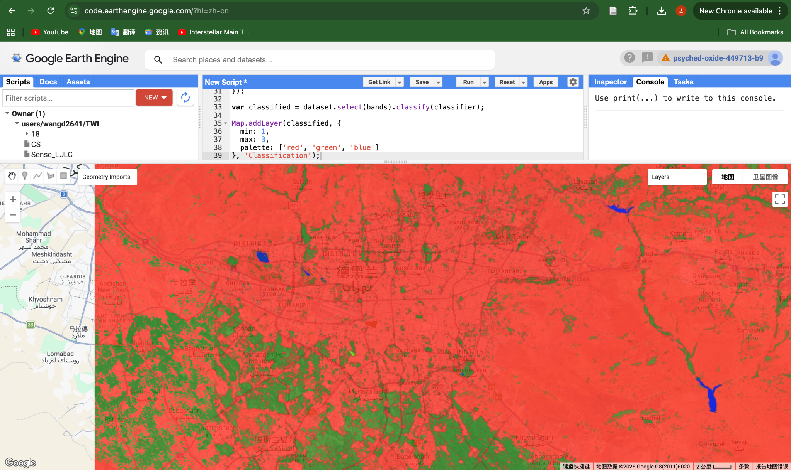

## Overview

This week introduced supervised classification using Google Earth Engine (GEE). The aim was to classify land cover types based on training data and spectral information from satellite imagery.

## Key Concepts

Classification is a process of assigning each pixel in an image to a specific land cover class. In supervised classification, training samples are manually defined and used to train a model.

Random Forest was used in this practical, which is an ensemble machine learning method that combines multiple decision trees to improve classification performance.

## Method

Sentinel-2 surface reflectance data was used for classification.

The workflow included:

-   loading Sentinel-2 imagery\
-   filtering by date, location, and cloud cover\
-   generating a median composite\
-   creating training samples (urban, vegetation, water)\
-   extracting spectral values from the image\
-   training a Random Forest classifier\
-   applying the classifier to the full image

## Results

**Figure 1.** Land cover classification of Tehran using Random Forest (urban = red, vegetation = green, water = blue).

The classification map distinguishes between urban areas, vegetation, and water. Urban areas dominate the central region, while vegetation is more prominent on the outskirts.

However, a large proportion of areas classified as vegetation appear to correspond to agricultural land (cropland) rather than natural vegetation. This suggests that the classifier is capturing spectral similarities between vegetation types, but is unable to distinguish between different land use categories within the vegetation class.

## Application

Image classification is widely used in urban studies, including land use mapping, environmental monitoring, and change detection.

This method enables large-scale automated mapping of land cover, which can support urban planning and environmental policy.

## Reflection

This week introduced machine learning concepts in remote sensing. I found it particularly useful to understand how training data influences classification results.

The results highlight that classification outputs are highly dependent on how training samples are defined. In this case, the vegetation class likely includes both natural vegetation and cropland, indicating that spectral similarity can limit the ability to distinguish land use types.

This demonstrates the importance of carefully designing training data and class definitions.

## Limitations

The classification accuracy depends heavily on the quality and quantity of training data. Misclassification can occur if classes are not well separated.

Additionally, spectral similarity between different land cover types (e.g. cropland and natural vegetation) can reduce model performance.

## Future Work

Future work could include:

-   introducing additional classes (e.g. separating cropland and natural vegetation)\
-   increasing the number and quality of training samples\
-   performing accuracy assessment using validation data\
-   comparing different classifiers (e.g. SVM, CART)
