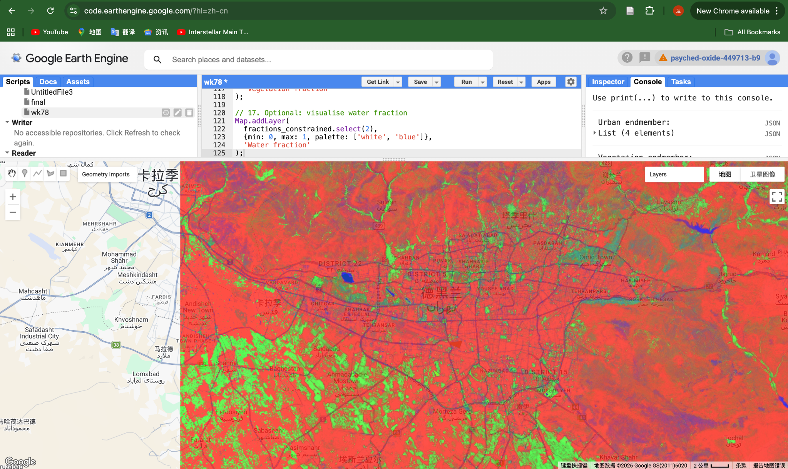

## Overview

This week focused on analysing urban environments using spectral indices and sub-pixel classification techniques in Google Earth Engine.

The aim was to explore how mixed land cover within a single pixel can be better represented, particularly in complex urban landscapes.

------------------------------------------------------------------------

## Key Concepts

Sub-pixel analysis (spectral unmixing) estimates the proportion of different land cover types within a single pixel.

Unlike traditional classification, which assigns one class per pixel, this method captures mixed surfaces such as urban areas containing vegetation or bare soil.

NDVI was also used to identify vegetation patterns and support interpretation.

------------------------------------------------------------------------

## Method

Sentinel-2 surface reflectance imagery was used.

The workflow included:

-   loading Sentinel-2 data
-   filtering by date, location, and cloud cover
-   generating a median composite
-   visualising RGB imagery
-   calculating NDVI
-   defining endmembers (urban, vegetation, water, bare earth)
-   extracting spectral signatures
-   applying spectral unmixing
-   constraining fractions to ensure valid outputs

------------------------------------------------------------------------

## Results

### RGB Composite

**Figure 1.** True colour RGB composite of Tehran.

The RGB image shows clear urban structure, with dense built-up areas concentrated in the city centre and more heterogeneous land cover at the outskirts.

------------------------------------------------------------------------

### NDVI

**Figure 2.** NDVI map highlighting vegetation distribution.

Vegetation is mainly located on the outskirts of the city. In this context, many high NDVI areas likely represent cropland rather than natural vegetation.

------------------------------------------------------------------------

### Sub-pixel Classification (Constrained)

**Figure 3.** Sub-pixel land cover fractions derived using spectral unmixing.

The constrained fraction map shows a clear spatial pattern of land cover distribution. Urban areas dominate the central region of Tehran (red), while vegetation (green) is more prominent in surrounding agricultural areas. Water bodies (blue) are clearly identifiable.

Compared to unconstrained outputs, this result is more realistic, as fractions are forced to sum to one and negative values are avoided.

------------------------------------------------------------------------

## Application

Sub-pixel analysis is particularly useful in urban environments where land cover is highly mixed.

It allows for:

-   identifying urban intensity
-   detecting green infrastructure
-   supporting urban planning and sustainability analysis

This approach is valuable for understanding urban form beyond simple classification.

------------------------------------------------------------------------

## Reflection

This week introduced a more advanced approach to classification. I found sub-pixel analysis particularly insightful, as it better represents the complexity of urban environments.

It highlighted how traditional classification may oversimplify land cover, especially in areas with mixed surfaces.

------------------------------------------------------------------------

## Limitations

The results depend heavily on the selection of endmembers. If training areas are not representative, the fractions may be biased.

Additionally, spectral similarity between urban surfaces and bare land can lead to overestimation of urban fractions, especially in arid environments like Tehran.

------------------------------------------------------------------------

## Future Work

Future improvements could include:

-   using additional spectral indices to improve separation
-   incorporating higher-resolution data
-   testing alternative unmixing approaches
-   validating results with ground truth data
